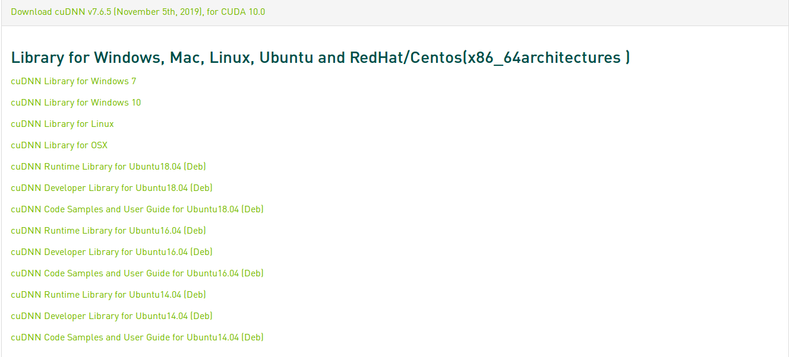
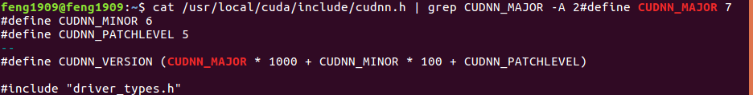
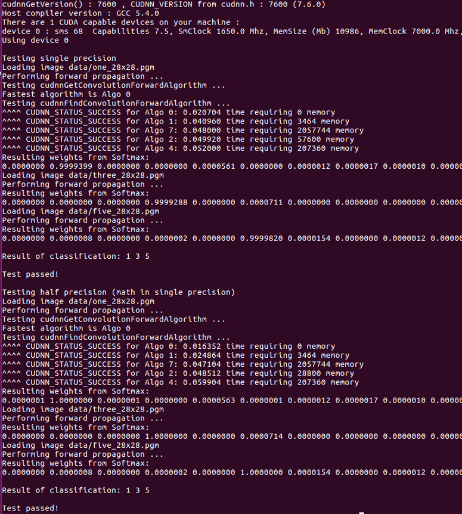

# Ubuntu16.04下CUDA10.0及对应cuDNN的安装及检验

## CUDA10.0

1. Verify that your GPU is CUDA-capable

```shell
$ lspci | grep -i nvidia
```

2. Verify the System Has gcc installed

```shell
$ gcc --version
```

3. 从[英伟达官网](https://developer.nvidia.com/cuda-10.0-download-archive?target_os=Linux&target_arch=x86_64&target_distro=Ubuntu&target_version=1604&target_type=deblocal)下载CUDA

   选择如下图安装包

   

4. 安装.deb包

```shell
sudo dpkg -i cuda-repo-<distro>_<version>_<architecture>.deb 	# 使用TAB
sudo apt-key add /var/cuda-repo-<version>/7fa2af80.pub`			# 使用TAB
sudo apt-get update
sudo apt-get install cuda
```

5. 检验是否安装成功

```shell
nvcc -V
```

* 如果没有输出信息或者输出版本不为`release 10.0`

  ```shell
  gedit ~/.bashrc
  ```

  在最下方加入

  ```bash
  export LD_LIBRARY_PATH=$LD_LIBRARY_PATH:/usr/local/cuda-10.0/lib64
  export PATH=$PATH:/usr/local/cuda-10.0/bin
  export CUDA_HOME=$CUDA_HOME:/usr/local/cuda-10.0
  ```

  **不同路径之间注意路径的变更**

  ```shell
  source ~/.bashrc
  ```

  再次执行

  ```shell
  nvcc -V
  ```

  此时可见CUDA版本信息

  

## cuDNN v7.6.5

选择 [Download cuDNN v7.6.5 (November 5th, 2019), for CUDA 10.0](https://developer.nvidia.com/rdp/cudnn-archive)



下载下列文件

* cuDNN Library for Linux
* cuDNN Runtime Library for Ubuntu16.04[Deb]
* cuDNN Developer Library for Ubuntu16.04[Deb]
* cuDNN Runtime Library for Ubuntu16.04[Deb]

**将下载的`cudnn-10.0-linux-x64-v7.6.5.32.tgz`解压**

在其目录中打开终端

```shell
sudo cp cuda/include/cudnn.h /usr/local/cuda/include/
sudo cp cuda/lib64/libcudnn* /usr/local/cuda/lib64/
sudo chmod a+r /usr/local/cuda/include/cudnn.h
sudo chmod a+r /usr/local/cuda/lib64/libcudnn*
```

**查看cudnn版本**

```shell
cat /usr/local/cuda/include/cudnn.h | grep CUDNN_MAJOR -A 2
```

如出现下图则成功



**注：有可能没有输出**

此时将下载的三个.deb文件使用dpkg -i命令安装

在安装过程中可能出现无法覆写的管道错误，此时使用--force-write的强制覆写命令可顺利安装（具体复制报错进行百度，我忘了是什么命令了

然后

```shell
cp -r /usr/src/cudnn_samples_v7/ /home/{用户名}
cd /home/{用户名}/cudnn_samples_v7/mnistCUDNN
make clean && make
./mnistCUDNN
```

如果安装成功




