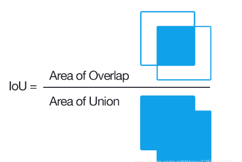

# 深度学习中某些英文简称的概念

## BBox

**Bounding Box，边界框**

* 绿色为人工标注的**ground-truth**，红色为预测结果
* xyxy：左上+右下
* xywh：左上+宽高

## Anchor

**Anchor：锚框**

* 人为设定不同长宽比、面积的先验框
* 在单阶段SSD检测算法中也称**Prior box**

## RoI

**RoI：Region of Interest**

* 特定的感兴趣区域

## Region Proposal

* 候选区域/框

## RPN

**RPN：Region Proposal Network**

* Acnhor-based的两阶段提取候选框的网络

## IoU

**IoU：Intersaction over Union**

* 评价预测框的质量，IoU越大则预测框与标注越接近

## mAP

$Percision(准确率/查准率)=\frac{TP}{TP+FP}=\frac{TP}{所有检测到物体}$

$Recall(召回率/查全率)=\frac{TP}{TP+FN}=\frac{TP}{所有标注框的个数}$

* TP：IoU>=阈值（如0.3）检测框数量
* FP：IoU<阈值（如0.3）检测框数量
* FN：没有检测到的GT数量

**在多组数据中**

* P-R曲线：以Precision、Recall为纵、横坐标的曲线
* AP(Average Precision)：某一类P-R曲线下的面积
* mAP(mean Average Precision)：所有类别AP平均

**详见**  [参考项目](https://github.com/rafaelpadilla/Object-Detection-Metrics)

## NMS

**NMS：非极大值抑制，Non-Maximun Suppression**

