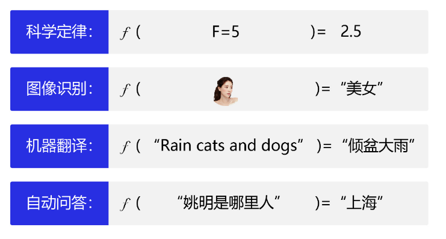
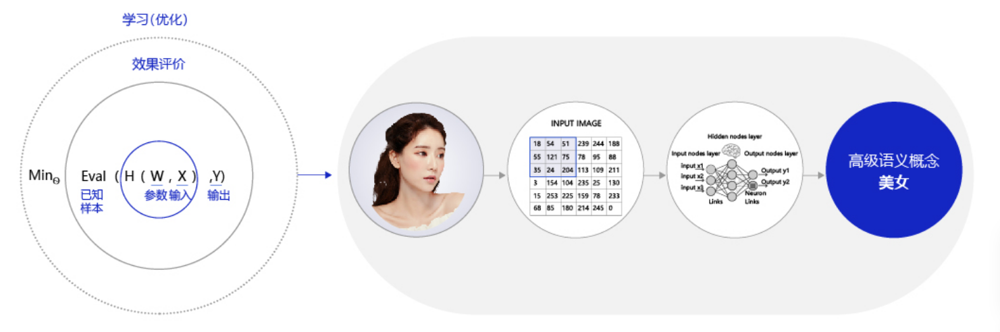
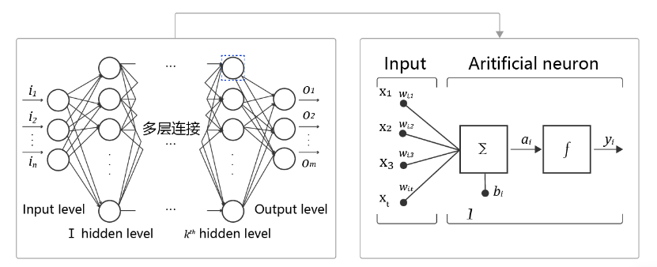

# 机器学习和深度学习综述

## 人工智能、机器学习、深度学习的关系

人工智能是最宽泛的概念，机器学习是当前比较有效的一种实现人工智能的方式，深度学习是机器学习算法中最热门的一个分支。三者的关系如图：

## 人工智能

## 机器学习

区别于人工智能，机器学习、尤其是监督学习则有更加明确的指代。机器学习是专门研究计算机怎样模拟或实现人类的学习行为，以获取新的知识或技能，重新组织已有的知识结构，使之不断改善自身的性能。

### 机器学习的实现

​	机器学习的实现可以分为两步：

* 归纳：从数据中抽象出规律，学习输出Y与输入X的关系
* 演绎：从一般规律推到出结果，基于归纳的规律，对新出现的X计算Y

### 机器学习的方法论

1. 确定模型参数，模型有效的基本条件是能够拟合已知的样本

2. 衡量模型预测值和真实值差距的评价函数也被称为损失函数（损失Loss）

3. 构成模型的三个部分： 模型假设、评价函数、优化算法

   如图为机器执行学习的框架：

   

#### 模型假设

世界上的可能关系千千万，漫无目标的试探Y*~X*之间的关系显然是十分低效的。因此假设空间先圈定了一个模型能够表达的关系可能，如蓝色圆圈所示。机器还会进一步在假设圈定的圆圈内寻找最优的Y*~*X*关系，即确定参数*W*。

#### 评价函数

寻找最优之前，我们需要先定义什么是最优，即评价一个*Y*~X*关系的好坏的指标。通常衡量该关系是否能很好的拟合现有观测样本，将拟合的误差最小作为优化目标。

#### 优化算法

设置了评价指标后，就可以在假设圈定的范围内，将使得评价指标最优（损失函数最小/最拟合已有观测样本）的*Y*~X*关系找出来，这个寻找的方法即为优化算法。最笨的优化算法即按照参数的可能，穷举每一个可能取值来计算损失函数，保留使得损失函数最小的参数作为最终结果。

机器执行学习的框架体现了其学习的本质是“参数估计”，在此基础上，许多看起来完全不一样的问题都可以使用同样的框架进行学习，如科学定律、图像识别、机器翻译和自动问答等，它们的学习目标都是拟合一个“大公式”：

## 深度学习

多数机器学习任务都可以使用深度学习模型解决，尤其在语音、计算机视觉和自然语言处理等领域，深度学习模型的效果比传统机器学习算法有显著提升。其实**两者在理论结构上是一致的，即：模型假设、评价函数和优化算法，其根本差别在于假设的复杂度**

不是所有的任务都像牛顿第二定律那样简单直观。对于图中照片，人脑可以接收到五颜六色的光学信号，能用极快的速度反应出这张图片是一个头像。但对计算机而言，只能接收到一个数字矩阵，对于美女这种高级的语义概念，从像素到高级语义概念中间要经历的信息变换的复杂性是难以想象的！这种变换已经无法用数学公式表达，因此研究者们借鉴了人脑神经元的结构，设计出神经网络的模型。

### 神经网络的基本概念

人工神经网络包括多个神经网络层，如卷积层、全连接层、LSTM等，每一层又包括很多神经元，超过三层的非线性神经网络都可以被称为深度神经网络。通俗的讲，深度学习的模型可以视为是输入到输出的映射函数，如图像到高级语义（美女）的映射，足够深的神经网络理论上可以拟合任何复杂的函数。因此神经网络非常适合学习样本数据的内在规律和表示层次，对文字、图像和语音任务有很好的适用性。因为这几个领域的任务是人工智能的基础模块，所以深度学习被称为实现人工智能的基础也就不足为奇了。

* **神经元：**神经网络中每个节点称为神经元，由两部分组成：
  * 加权和：将所有输入加权求和。
  * 非线性变换（激活函数）：加权和的结果经过一个非线性函数变换，让神经元计算具备非线性的能力。
* **多层连接：** 大量这样的节点按照不同的层次排布，形成多层的结构连接起来，即称为神经网络。
* **前向计算：**从输入计算输出的过程，顺序从网络前至后。
* **计算图：**以图形化的方式展现神经网络的计算逻辑又称为计算图。我们也可以将神经网络的计算图以公式的方式表达，如下：

 
    Y = f3(f2(f1(w1*x1+w2*x2+w3*x3+b)+...)...)

