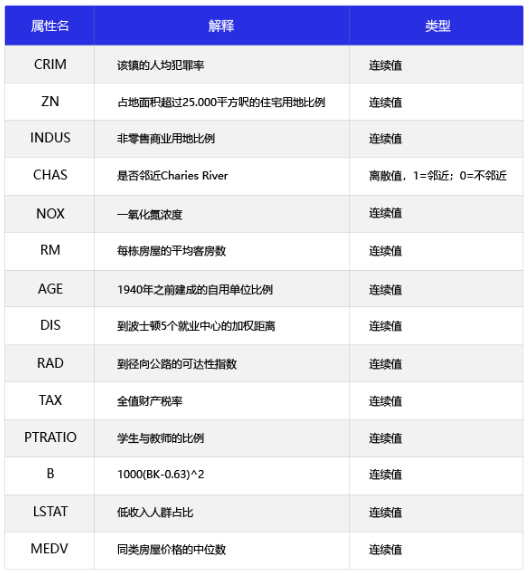
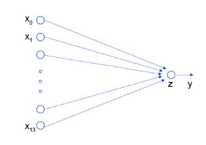
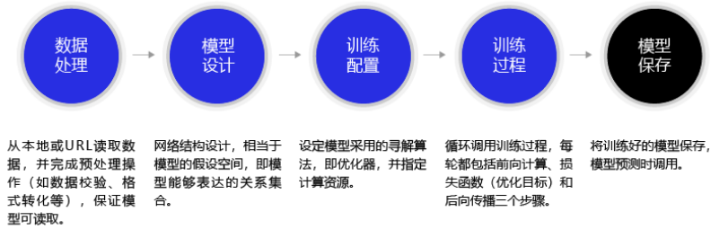

# 波士顿房价预测任务

波士顿房价预测是一个经典的机器学习任务，类似于程序员世界的“Hello World”。和大家对房价的普遍认知相同，波士顿地区的房价受诸多因素影响。该数据集统计了13种可能影响房价的因素和该类型房屋的均价，期望构建一个基于13个因素进行房价预测的模型，如图所示：



对于预测问题，可以根据预测输出的类型是连续的实数值，还是离散的标签，区分为回归任务和分类任务。因为房价是一个连续值，所以房价预测显然是一个回归任务。

## 线性回归模型

假设房价和各影响因素之间能够用线性关系来描述：

​                                                            *y* = $ \sum_{j=1}^M$ *$x_{j}$* *$w_{j}$* +*b*

模型的求解即是通过数据拟合出每个*$w_{j}$*和*b*。其中，*$w_{j}$*和*b*分别表示该线性模型的权重和偏置。一维情况下是，*$w_{j}$*和*b*直线的斜率和截距。

线性回归模型使用均方误差作为损失函数（Loss），用以衡量预测房价和真实房价的差异，公式如下：

​                                                           *MSE* = $\frac{1}{n} \sum_{i=1}^n(\hat{Y}_{i}-Y_{i})^{2}$

### 线性回归模型的神经网络结构

神经网络的标准结构中每个神经元由加权和与非线性变换构成，然后将多个神经元分层的摆放并连接形成神经网络。线性回归模型可以认为是神经网络模型的一种极简特例，是一个只有加权和、没有非线性变换的神经元（无需形成网络）



## 构建波士顿房价预测任务的神经网络模型

深度学习不仅实现了模型的端到端学习，还推动了人工智能进入工业大生产阶段，产生了标准化、自动化和模块化的通用框架。不同场景的深度学习模型具备一定的通用性，五个步骤即可完成模型的构建和训练



### 数据处理

数据处理包含五个部分：数据导入、数据形状变换、数据集划分、数据归一化处理和封装`load data`函数。数据预处理后，才能被模型调用。

#### 读入数据

```python
import numpy as import np
import json

datafile = './work/housing.data'
data = np.fromfile(datafile, sep = ' ')		#读入数据
```

#### 数据形状变换

由于读入的原始数据是1维的，所有数据都连在一起。因此需要我们将数据的形状进行变换，形成一个2维的矩阵，每行为一个数据样本（14个值），每个数据样本包含13个X（影响房价的特征）和一个Y（该类型房屋的均价）。

```python
feature_names = ['CRIM', 'ZN', 'INDUS', 'CHAS', 'NOX', 'RM', 'AGE','DIS', 
                 'RAD', 'TAX', 'PTRATIO', 'B', 'LSTAT', 'MEDV' ]
                 # 十三种影响因素
feature_num = len(feature_names)
data = data.reshape([data.shape[0] // feature_num, feature_num])
				 # //是整除符号
```

#### 数据集划分

将数据集划分成训练集和测试集，其中训练集用于确定模型的参数，测试集用于评判模型的效果

在本案例中，我们将80%的数据用作训练集，20%用作测试集，实现代码如下。通过打印训练集的形状，可以发现共有404个样本，每个样本含有13个特征和1个预测值。

```python
ratio = 0.8
offset = int(data.shape[0] * ratio)
train_data = data[:offset]
```

#### 数据归一化处理

对每个特征进行归一化处理，使得每个特征的取值缩放到0~1之间。这样做有两个好处：一是模型训练更高效；二是特征前的权重大小可以代表该变量对预测结果的贡献度（因为每个特征值本身的范围相同）

[numpy中axis参数的解释](https://blog.csdn.net/xiongchengluo1129/article/details/79062991)

```python
maximums, minimuns, avgs = \
	training_data.max(axis=0),\
    training_data.min(axis=0),\
    training_data.sum(axis=0) / training_data.shape[0]
    
    '''
    axis参数：
    通过指定不同的axis，numpy会沿着不同的维度进行操作，如果不设置，则表示对所有的元素进行
    作，如果axis=0，则沿着纵轴进行操作，若axis=1则沿着横轴进行操作。但是这只是仅仅对于二维数
    组而言。但是可以总结为一句话：设axis=i ,则numpy沿着第i个下标的维度进行操作，
    '''

for i in range(feature_num):
    data[:, i] = (data[: i] - minimums[i]) / (maximums[i] - minimuns[i])
    #将所有数据缩小到0~1的范围内
```

#### 模型设计

模型设计是深度学习模型关键要素之一，也称为网络结构设计，相当于模型的假设空间，即实现模型“前向计算”（从输入到输出）的过程。

如果将输入特征和输出预测值均以向量表示，输入特征xx*x*有13个分量，*y*有1个分量，那么参数权重的形状（shape）是13×113$\times$113×1。

完整的线性回归公式，还需要初始化偏移量*b*

```python
class Network(object):
    def __init__(self, num_of_weights):
        # 随机产生w的初始值
        # 为了保持程序每次运行结果的一致性，
        # 此处设置固定的随机数种子
        np.random.seed(0)
        self.w = np.random.randn(num_of_weights, 1)
        self.b = 0.
        
    def forward(self, x):
        z = np.dot(x, self.w) + self.b
        return z
```

#### 训练配置

模型设计完成后，需要通过训练配置寻找模型的最优值，即通过损失函数来衡量模型的好坏。训练配置也是深度学习模型关键要素之一。

通过模型计算*$x_{1}$*表示的影响因素所对应的房价应该是*z*, 但实际数据告诉我们房价是*y*。这时我们需要有某种指标来衡量预测值*z*跟真实值*y*之间的差距。对于回归问题，最常采用的衡量方法是使用均方误差作为评价模型好坏的指标，具体定义如下：

​                                                        *Loss* = $(y - z)^{2}$

上式中的*Loss*（简记为: *L*）通常也被称作损失函数，它是衡量模型好坏的指标。在回归问题中，均方误差是一种比较常见的形式，分类问题中通常会采用交叉熵作为损失函数，在后续的章节中会更详细的介绍。对一个样本计算损失函数值的实现如下：

```python

class Network(object):
    def __init__(self, num_of_weights):
        # 随机产生w的初始值
        # 为了保持程序每次运行结果的一致性，此处设置固定的随机数种子
        np.random.seed(0)
        self.w = np.random.randn(num_of_weights, 1)
        self.b = 0.
        
    def forward(self, x):
        z = np.dot(x, self.w) + self.b
        return z
    
    def loss(self, z, y):
        error = z - y
        cost = error * error
        cost = np.mean(cost)
        return cost
```

使用定义的Network类，可以方便的计算预测值和损失函数。需要注意的是，类中的变量*x*, *w*，b*, z*, *error*等均是向量。以变量*x*为例，共有两个维度，一个代表特征数量（值为13），一个代表样本数量，代码如下所示:

```python
net = Network(13)
# 此处可以一次性计算多个样本的预测值和损失函数
x1 = x[0:3]
y1 = y[0:3]
z = net.forward(x1)
print('predict: ', z)
loss = net.loss(z, y1)
print('loss:', loss)
```

#### 训练过程

梯度下降法：略

#### 代码封装Train函数

将上面的循环计算过程封装在`train`和`update`函数中，实现方法如下所示。

```python
class Network(object):
    def __init__(self, num_of_weights):
        # 随机产生w的初始值
        # 为了保持程序每次运行结果的一致性，此处设置固定的随机数种子
        np.random.seed(0)
        self.w = np.random.randn(num_of_weights,1)
        self.w[5] = -100.
        self.w[9] = -100.
        self.b = 0.
        
    def forward(self, x):
        z = np.dot(x, self.w) + self.b
        return z
    
    def loss(self, z, y):
        error = z - y
        num_samples = error.shape[0]
        cost = error * error
        cost = np.sum(cost) / num_samples
        return cost
    
    def gradient(self, x, y):
        z = self.forward(x)
        gradient_w = (z-y)*x
        gradient_w = np.mean(gradient_w, axis=0)
        gradient_w = gradient_w[:, np.newaxis]
        gradient_b = (z - y)
        gradient_b = np.mean(gradient_b)        
        return gradient_w, gradient_b
    
    def update(self, graident_w5, gradient_w9, eta=0.01):
        net.w[5] = net.w[5] - eta * gradient_w5
        net.w[9] = net.w[9] - eta * gradient_w9
        
    def train(self, x, y, iterations=100, eta=0.01):
        points = []
        losses = []
        for i in range(iterations):
            points.append([net.w[5][0], net.w[9][0]])
            z = self.forward(x)
            L = self.loss(z, y)
            gradient_w, gradient_b = self.gradient(x, y)
            gradient_w5 = gradient_w[5][0]
            gradient_w9 = gradient_w[9][0]
            self.update(gradient_w5, gradient_w9, eta)
            losses.append(L)
            if i % 50 == 0:
                print('iter {}, point {}, loss {}'.format(i, [net.w[5][0], net.w[9][0]], L))
        return points, losses

# 获取数据
train_data, test_data = load_data()
x = train_data[:, :-1]
y = train_data[:, -1:]
# 创建网络
net = Network(13)
num_iterations=2000
# 启动训练
points, losses = net.train(x, y, iterations=num_iterations, eta=0.01)

# 画出损失函数的变化趋势
plot_x = np.arange(num_iterations)
plot_y = np.array(losses)
plt.plot(plot_x, plot_y)
plt.show()
```

