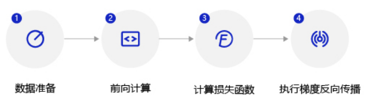

# 使用飞桨构建波士顿房价预测模型

```python
import paddle
import paddle.fluid as fluid
import paddle.fluid.dygraph as dygraph
from paddle.fluid.dygraph import Linear
import numpy as np
import os
import random
```

* paddle/fluid：飞桨主库，大部分实用函数再paddle.fluid包内
* dygraph：动态图的类库
* Linear：神经网络的全连接层函数，即包含左右输入权重相加和激活函数的基本神经元结构。在房价预测任务中，使用只有一层的神经网络（全连接层）来实现线性回归模型。

**静态图和动态图**

* 静态图模式（声明式编程范式，类比C++）：先编译后执行的方式。用户需预先定义完整的网络结构，再对网络结构进行编译优化后，才能执行获得计算结果。
* 动态图模式（命令式编程范式，类比Python）：解析式的执行方式。用户无需预先定义完整的网络结构，每写一行网络代码，即可同时获得计算结果。

## 数据处理

数据处理不依赖框架实现

```python
def load_data():
    datafile = './work/housing.data'
    data = np.fromfile(datafile, sep=' ')

    # 每条数据包括14项，其中前面13项是影响因素，第14项是相应的房屋价格中位数
    feature_names = [ 'CRIM', 'ZN', 'INDUS', 'CHAS', 'NOX', 'RM', 'AGE', \
                      'DIS', 'RAD', 'TAX', 'PTRATIO', 'B', 'LSTAT', 'MEDV' ]
    feature_num = len(feature_names)

    # 将原始数据进行Reshape，变成[N, 14]这样的形状
    data = data.reshape([data.shape[0] // feature_num, feature_num])

    # 将原数据集拆分成训练集和测试集
    # 这里使用80%的数据做训练，20%的数据做测试
    # 测试集和训练集必须是没有交集的
    ratio = 0.8
    offset = int(data.shape[0] * ratio)
    training_data = data[:offset]

    # 计算train数据集的最大值，最小值，平均值
    maximums, minimums, avgs = training_data.max(axis=0), training_data.min(axis=0), \
                                 training_data.sum(axis=0) / training_data.shape[0]
    
    # 记录数据的归一化参数，在预测时对数据做归一化
    global max_values
    global min_values
    global avg_values
    max_values = maximums
    min_values = minimums
    avg_values = avgs

    # 对数据进行归一化处理
    for i in range(feature_num):
        #print(maximums[i], minimums[i], avgs[i])
        data[:, i] = (data[:, i] - avgs[i]) / (maximums[i] - minimums[i])

    # 训练集和测试集的划分比例
    #ratio = 0.8
    #offset = int(data.shape[0] * ratio)
    training_data = data[:offset]
    test_data = data[offset:]
    return training_data, test_data
```

## 模型设计

模型定义的实质是定义线性回归的网络结构，飞桨建议通过创建Python类的方式完成模型网络的定义，即定义`init`函数和`forward`函数。`forward`函数是框架指定实现前向计算逻辑的函数，程序在调用模型实例时会自动执行forward方法。在`forward`函数中使用的网络层需要在`init`函数中声明。

实现过程分如下两步：

* **定义init函数**：在类的初始化函数中声明每一层网络的实现函数。在房价预测模型中，只需要定义一层全连接层。
* **定义forward函数**：构建神经网络结构，实现前向计算过程，并返回预测结果，在本任务中返回的是房价预测结果。

```python
class Regressor(fluid.dygraph.Layer):
    def __init__(self):
        super(Regressor, self).__init__()
        
        # 定义一层全连接层，输出维度是1，激活函数为None，即不使用激活函数
        self.fc = Linear(input_dim=13, output_dim=1, act=None)
    
    # 网络的前向计算函数
    def forward(self, inputs):
        x = self.fc(inputs)
        return x
```

## 训练配置

训练配置过程包含四步：


1. 以`guard`函数指定运行训练的机器资源，表明在`with`作用域下的程序均执行在本机的CPU资源上。`dygraph.guard`表示在`with`作用域下的程序会以飞桨动态图的模式执行（实时执行）。
2. 声明定义好的回归模型Regressor实例，并将模型的状态设置为训练。
3. 使用load_data函数加载训练数据和测试数据。
4. 设置优化算法和学习率，优化算法采用随机梯度下降[SGD](https://www.paddlepaddle.org.cn/documentation/docs/zh/api_cn/optimizer_cn/SGDOptimizer_cn.html#cn-api-fluid-optimizer-sgdoptimizer)，学习率设置为0.01。

```python
# 定义飞桨动态图的工作环境
with fluid.dygraph.guard():
    # 声明定义好的线性回归模型
    model = Regressor()
    # 开启模型训练模式
    model.train()
    # 加载数据
    training_data, test_data = load_data()
    # 定义优化算法，这里使用随机梯度下降-SGD
    # 学习率设置为0.01
    opt = fluid.optimizer.SGD(learning_rate=0.01, parameter_list=model.parameters())
```

1. 默认本案例运行在读者的笔记本上，因此模型训练的机器资源为CPU。
2. 模型实例有两种状态：训练状态`.train()`和预测状态`.eval()`。训练时要执行正向计算和反向传播梯度两个过程，而预测时只需要执行正向计算。为模型指定运行状态，有两点原因：

（1）部分高级的算子（例如Drop out和Batch Normalization，在计算机视觉的章节会详细介绍）在两个状态执行的逻辑不同。

（2）从性能和存储空间的考虑，预测状态时更节省内存，性能更好。

3. 在上述代码中可以发现声明模型、定义优化器等操作都在`with`创建的 [fluid.dygraph.guard()](https://www.paddlepaddle.org.cn/documentation/docs/zh/api_cn/dygraph_cn/guard_cn.html#guard)上下文环境中进行，可以理解为`with fluid.dygraph.guard()`创建了飞桨动态图的工作环境，在该环境下完成模型声明、数据转换及模型训练等操作。

## 训练过程

训练过程采用二层循环嵌套方式：

- **内层循环：** 负责整个数据集的一次遍历，采用分批次方式（batch）。假设数据集样本数量为1000，一个批次有10个样本，则遍历一次数据集的批次数量是1000/10=100，即内层循环需要执行100次。

  ```
    for iter_id, mini_batch in enumerate(mini_batches):
  ```

- **外层循环：** 定义遍历数据集的次数，通过参数EPOCH_NUM设置。

  ```
    for epoch_id in range(EPOCH_NUM):
  ```

batch的取值会影响模型训练效果。batch过大，会增大内存消耗和计算时间，且效果并不会明显提升；batch过小，每个batch的样本数据将没有统计意义。由于房价预测模型的训练数据集较小，我们将batch为设置10。

每次内层循环都需要执行如下四个步骤:



1. 数据准备：将一个批次的数据转变成np.array和内置格式`dygraph.to_variable(x)` 。
2. 前向计算：将一个批次的样本数据灌入网络中，计算输出结果。
3. 计算损失函数：以前向计算结果和真实房价作为输入，通过损失函数[square_error_cost](https://www.paddlepaddle.org.cn/documentation/docs/zh/api_cn/layers_cn/square_error_cost_cn.html#square-error-cost/)计算出损失函数值（Loss）。飞桨所有的API接口都有完整的说明和使用案例，在后续的资深教程中我们会详细介绍API的查阅方法。
4. 反向传播：执行梯度反向传播`backward`函数，即从后到前逐层计算每一层的梯度，并根据设置的优化算法更新参数`opt.minimize`。

```python
with dygraph.guard(fluid.CPUPlace()):  # 使用CPU  /(CUDCPlace(0))
    EPOCH_NUM = 10   # 设置外层循环次数
    BATCH_SIZE = 10  # 设置batch大小
    
    # 定义外层循环
    for epoch_id in range(EPOCH_NUM):
        # 在每轮迭代开始之前，将训练数据的顺序随机的打乱
        np.random.shuffle(training_data)
        # 将训练数据进行拆分，每个batch包含10条数据
        mini_batches = [training_data[k:k+BATCH_SIZE] for k in range(0, len(training_data), BATCH_SIZE)]
        # 定义内层循环
        for iter_id, mini_batch in enumerate(mini_batches):
            x = np.array(mini_batch[:, :-1]).astype('float32') 
            # 获得当前批次训练数据
            y = np.array(mini_batch[:, -1:]).astype('float32') 
            # 获得当前批次训练标签（真实房价）
            
            # 将numpy数据转为飞桨动态图variable形式
            house_features = dygraph.to_variable(x)
            prices = dygraph.to_variable(y)
            
            # 前向计算
            predicts = model(house_features)
            
            # 计算损失
            loss = fluid.layers.square_error_cost(predicts, label=prices)
            avg_loss = fluid.layers.mean(loss)
            if iter_id%20==0:
                print("epoch: {}, iter: {}, loss is: {}".format(epoch_id, iter_id, avg_loss.numpy()))
            
            # 反向传播
            avg_loss.backward()
            # 最小化loss,更新参数
            opt.minimize(avg_loss)
            # 清除梯度
            model.clear_gradients()
    # 保存模型
    fluid.save_dygraph(model.state_dict(), 'LR_model')
```

## 保存并测试模型

### 保存模型

将模型当前的参数数据`model.state_dict()`保存到文件中（通过参数指定保存的文件名 LR_model），以备预测或校验的程序调用，代码如下所示。

```python
# 定义飞桨动态图工作环境
with fluid.dygraph.guard():
    # 保存模型参数，文件名为LR_model
    fluid.save_dygraph(model.state_dict(), 'LR_model')
    print(model.state_dict())
    print("模型保存成功，模型参数保存在LR_model中")
```

### 测试模型

测试过程和在应用场景中使用模型的过程一致，主要可分成如下三个步骤：

1. 配置模型预测的机器资源。本案例默认使用本机，因此无需写代码指定。
2. 将训练好的模型参数加载到模型实例中。由两个语句完成，第一句是从文件中读取模型参数；第二句是将参数内容加载到模型。加载完毕后，需要将模型的状态调整为`eval()`（校验）。上文中提到，训练状态的模型需要同时支持前向计算和反向传导梯度，模型的实现较为臃肿，而校验和预测状态的模型只需要支持前向计算，模型的实现更加简单，性能更好。
3. 将待预测的样本特征输入到模型中，打印输出的预测结果。

通过`load_one_example`函数实现从数据集中抽一条样本作为测试样本，具体实现代码如下所示

```python

def load_one_example(data_dir):
    f = open(data_dir, 'r')
    datas = f.readlines()
    # 选择倒数第10条数据用于测试
    tmp = datas[-10]
    tmp = tmp.strip().split()
    one_data = [float(v) for v in tmp]

    # 对数据进行归一化处理
    for i in range(len(one_data)-1):
        one_data[i] = (one_data[i] - avg_values[i]) / (max_values[i] - min_values[i])

    data = np.reshape(np.array(one_data[:-1]), [1, -1]).astype(np.float32)
    label = one_data[-1]
    return data, label
    
with dygraph.guard():
    # 参数为保存模型参数的文件地址
    model_dict, _ = fluid.load_dygraph('LR_model')
    model.load_dict(model_dict)
    model.eval()

    # 参数为数据集的文件地址
    test_data, label = load_one_example('./work/housing.data')
    # 将数据转为动态图的variable格式
    test_data = dygraph.to_variable(test_data)
    results = model(test_data)

    # 对结果做反归一化处理
    results = results * (max_values[-1] - min_values[-1]) + avg_values[-1]
    print("Inference result is {}, the corresponding label is {}".format(results.numpy(), label))
```

