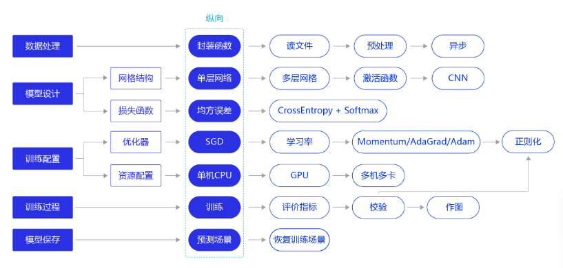
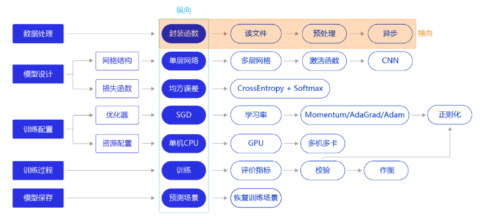
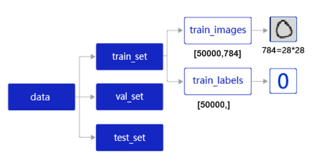
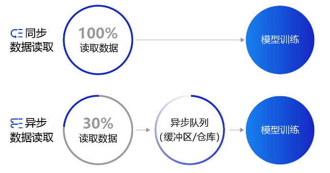

# 手写数字识别

学习路线：



## 数据处理



### 加载数据集

在工业实践中，我们面临的任务和数据环境千差万别，通常需要自己编写适合当前任务的数据处理程序，一般涉及如下五个环节：

- 读入数据
- 划分数据集
- 生成批次数据
- 训练样本集乱序
- 校验数据有效性

#### 环境准备：

```python
# 加载飞桨和相关数据处理的库
import paddle
import paddle.fluid as fluid
from paddle.fluid.dygraph.nn import Linear
import numpy as np
import os
import gzip
import json
import random
```

#### 读入数据并划分数据集

MNIST数据集的存储结构如下：



**data**包含三个元素的列表：**train_set**、**val_set**、 **test_set**，包括50000条训练样本，10000条测试样本，共60000条数据。每个样本包含手写数字图片和对应的标签。

- **train_set（训练集）**：用于确定模型参数。
- **val_set（验证集）**：用于调节模型超参数（如多个网络结构、正则化权重的最优选择）。
- **test_set（测试集）**：用于估计应用效果（没有在模型中应用过的数据，更贴近模型在真实场景应用的效果）。

**train_set**包含两个元素的列表：**train_images**、**train_labels**。

- **train_images**：[50000, 784]的二维列表，包含50000张图片。每张图片用一个长度为784的向量表示，内容是28*28尺寸的像素灰度值（黑白图片）。
- **train_labels**：[50000, ]的列表，表示这些图片对应的分类标签，即0-9之间的一个数字。

```python
# 声明数据集文件位置
datafile = './work/mnist.json.gz'
print('loading mnist dataset from {} ......'.format(datafile))
# 加载json数据文件
data = json.load(gzip.open(datafile))
print('mnist dataset load done')
# 读取到的数据区分训练集，验证集，测试集
train_set, val_set, eval_set = data

# 数据集相关参数，图片高度IMG_ROWS, 图片宽度IMG_COLS
IMG_ROWS = 28
IMG_COLS = 28

# 分隔图片与标签
imgs, labels = train_set[0], train_set[1]
print("训练数据集数量: ", len(imgs))

# 观察验证集数量
imgs, labels = val_set[0], val_set[1]
print("验证数据集数量: ", len(imgs))

# 观察测试集数量
imgs, labels = val= eval_set[0], eval_set[1]
print("测试数据集数量: ", len(imgs))
```

### 训练样本乱序、生成批次数据

- **训练样本乱序：** 先将样本按顺序进行编号，建立ID集合index_list。然后将index_list乱序，最后按乱序后的顺序读取数据。

------

**说明：**

通过大量实验发现，模型对最后出现的数据印象更加深刻。训练数据导入后，越接近模型训练结束，最后几个批次数据对模型参数的影响越大。为了避免模型记忆影响训练效果，需要进行样本乱序操作。

___

* **生成批次数据：** 先设置合理的batch_size，再将数据转变成符合模型输入要求的np.array格式返回。同时，在返回数据时将Python生成器设置为`yield`模式，以减少内存占用。

**yield：** 与`return`区别：

```python
print('yield:')
def _testyield():
    for i in range(5):
        yield i*i
#这里产生生成器对象,跟java对象意思相同
generator = _testyield()

for i in range(5):
    print(next(generator))

#-----------------------------------------------------------#

print('return:')
def _return(n):
    # 这里res是一个list[],得出的结果是[1,2,3,4,5]
    res = [i*i for i in range(n)]    
    return res

for i in _return(5):
    print(i)
```

输出为 

``` 
yield:
0
1
4
9
16
return:
0
1
4
9
16
```

**训练样本乱序、生成批次数据：**

```python
imgs, labels = train_set[0], train_set[1]
print("训练数据集数量: ", len(imgs))
# 获得数据集长度
imgs_length = len(imgs)
# 定义数据集每个数据的序号，根据序号读取数据
index_list = list(range(imgs_length))
# 读入数据时用到的批次大小
BATCHSIZE = 100

# 随机打乱训练数据的索引序号
random.shuffle(index_list)

# 定义数据生成器，返回批次数据
def data_generator():

    imgs_list = []
    labels_list = []
    for i in index_list:
        # 将数据处理成期望的格式，比如类型为float32，shape为[1, 28, 28]
        img = np.reshape(imgs[i], [1, IMG_ROWS, IMG_COLS]).astype('float32')
        label = np.reshape(labels[i], [1]).astype('float32')
        imgs_list.append(img) 
        labels_list.append(label)
        if len(imgs_list) == BATCHSIZE:
            # 获得一个batchsize的数据，并返回
            yield np.array(imgs_list), np.array(labels_list)
            # 清空数据读取列表
            imgs_list = []
            labels_list = []

    # 如果剩余数据的数目小于BATCHSIZE，
    # 则剩余数据一起构成一个大小为len(imgs_list)的mini-batch
    if len(imgs_list) > 0:
        yield np.array(imgs_list), np.array(labels_list)
    return data_generator

# 声明数据读取函数，从训练集中读取数据
train_loader = data_generator
# 以迭代的形式读取数据
for batch_id, data in enumerate(train_loader()):
    image_data, label_data = data
    if batch_id == 0:
        # 打印数据shape和类型
        print("打印第一个batch数据的维度:")
        print("图像维度: {}, 标签维度: {}".format(image_data.shape, label_data.shape))
    break
```


#### 封装数据读取与处理函数

```python
def load_data(mode='train'):
    datafile = './work/mnist.json.gz'
    print('loading mnist dataset from {} ......'.format(datafile))
    # 加载json数据文件
    data = json.load(gzip.open(datafile))
    print('mnist dataset load done')
   
    # 读取到的数据区分训练集，验证集，测试集
    train_set, val_set, eval_set = data
    if mode=='train':
        # 获得训练数据集
        imgs, labels = train_set[0], train_set[1]
    elif mode=='valid':
        # 获得验证数据集
        imgs, labels = val_set[0], val_set[1]
    elif mode=='eval':
        # 获得测试数据集
        imgs, labels = eval_set[0], eval_set[1]
    else:
        raise Exception("mode can only be one of ['train', 'valid', 'eval']")
    print("训练数据集数量: ", len(imgs))
    
    # 校验数据
    imgs_length = len(imgs)

    assert len(imgs) == len(labels), \
          "length of train_imgs({}) should be the same as train_labels({})".format(len(imgs), len(labels))
    
    # 获得数据集长度
    imgs_length = len(imgs)
    
    # 定义数据集每个数据的序号，根据序号读取数据
    index_list = list(range(imgs_length))
    # 读入数据时用到的批次大小
    BATCHSIZE = 100
    
    # 定义数据生成器
    def data_generator():
        if mode == 'train':
            # 训练模式下打乱数据
            random.shuffle(index_list)
        imgs_list = []
        labels_list = []
        for i in index_list:
            # 将数据处理成希望的格式，比如类型为float32，shape为[1, 28, 28]
            img = np.reshape(imgs[i], [1, IMG_ROWS, IMG_COLS]).astype('float32')
            label = np.reshape(labels[i], [1]).astype('float32')
            imgs_list.append(img) 
            labels_list.append(label)
            if len(imgs_list) == BATCHSIZE:
                # 获得一个batchsize的数据，并返回
                yield np.array(imgs_list), np.array(labels_list)
                # 清空数据读取列表
                imgs_list = []
                labels_list = []
    
        # 如果剩余数据的数目小于BATCHSIZE，
        # 则剩余数据一起构成一个大小为len(imgs_list)的mini-batch
        if len(imgs_list) > 0:
            yield np.array(imgs_list), np.array(labels_list)
    return data_generator
```

#### 下面定义一层神经网络，利用定义好的数据处理函数，完成神经网络的训练

```python
# 数据处理部分之后的代码，数据读取的部分调用load_data函数
# 定义网络结构，同上一节所使用的网络结构
class MNIST(fluid.dygraph.Layer):
    def __init__(self):
        super(MNIST, self).__init__()
        self.fc = Linear(input_dim=784, output_dim=1, act=None)

    def forward(self, inputs):
        inputs = fluid.layers.reshape(inputs, (-1, 784))
        outputs = self.fc(inputs)
        return outputs

# 训练配置，并启动训练过程
with fluid.dygraph.guard():
    model = MNIST()
    model.train()
    #调用加载数据的函数
    train_loader = load_data('train')
    optimizer = fluid.optimizer.SGDOptimizer(
        learning_rate=0.001, 														parameter_list=model.parameters())
    
    EPOCH_NUM = 10
    for epoch_id in range(EPOCH_NUM):
        for batch_id, data in enumerate(train_loader()):
            #准备数据，变得更加简洁
            image_data, label_data = data
            image = fluid.dygraph.to_variable(image_data)
            label = fluid.dygraph.to_variable(label_data)
            
            #前向计算的过程
            predict = model(image)
            
            #计算损失，取一个批次样本损失的平均值
            loss = fluid.layers.square_error_cost(predict, label)
            avg_loss = fluid.layers.mean(loss)
            
            #每训练了200批次的数据，打印下当前Loss的情况
            if batch_id % 200 == 0:
                print("epoch: {}, batch: {}, loss is: {}".format(epoch_id, batch_id, avg_loss.numpy()))
            
            #后向传播，更新参数的过程
            avg_loss.backward()
            optimizer.minimize(avg_loss)
            model.clear_gradients()

    #保存模型参数
    fluid.save_dygraph(model.state_dict(), 'mnist')
```


## 异步数据读取

上面提到的数据读取采用的是同步数据读取方式。对于样本量较大、数据读取较慢的场景，建议采用异步数据读取方式。异步读取数据时，数据读取和模型训练并行执行，从而加快了数据读取速度，牺牲一小部分内存换取数据读取效率的提升，二者关系如图所示：



- **同步数据读取**：数据读取与模型训练串行。当模型需要数据时，才运行数据读取函数获得当前批次的数据。在读取数据期间，模型一直等待数据读取结束才进行训练，数据读取速度相对较慢。
- **异步数据读取**：数据读取和模型训练并行。读取到的数据不断的放入缓存区，无需等待模型训练就可以启动下一轮数据读取。当模型训练完一个批次后，不用等待数据读取过程，直接从缓存区获得下一批次数据进行训练，从而加快了数据读取速度。
- **异步队列**：数据读取和模型训练交互的仓库，二者均可以从仓库中读取数据，它的存在使得两者的工作节奏可以解耦。

**fluid.io.DataLoader.from_generator参数名称和含义如下：**

- feed_list：仅在PaddlePaddle静态图中使用，动态图中设置为“None”，本教程默认使用动态图的建模方式；
- capacity：表示在DataLoader中维护的队列容量，如果读取数据的速度很快，建议设置为更大的值；
- use_double_buffer：是一个布尔型的参数，设置为“True”时，Dataloader会预先异步读取下一个batch的数据并放到缓存区；
- iterable：表示创建的Dataloader对象是否是可迭代的，一般设置为“True”；
- return_list：在动态图模式下需要设置为“True”。

```python
# 定义数据读取后存放的位置，CPU或者GPU，这里使用CPU
# place = fluid.CUDAPlace(0) 时，数据才读取到GPU上
place = fluid.CPUPlace()
with fluid.dygraph.guard(place):
    # 声明数据加载函数，使用训练模式
#======================新代码==========================#
    train_loader = load_data(mode='train')
    # 定义DataLoader对象用于加载Python生成器产生的数据
    data_loader = fluid.io.DataLoader.from_generator(capacity=5, return_list=True)
    # 设置数据生成器
    data_loader.set_batch_generator(train_loader, places=place)
#=====================================================#
    # 迭代的读取数据并打印数据的形状
    for i, data in enumerate(data_loader):
        image_data, label_data = data
        print(i, image_data.shape, label_data.shape)
        if i>=5:
            break
```

#### 完整代码：

```python
with fluid.dygraph.guard():
    model = MNIST()
    model.train()
    #调用加载数据的函数
    train_loader = load_data('train')
    # 创建异步数据读取器
    place = fluid.CPUPlace()
    data_loader = fluid.io.DataLoader.from_generator(capacity=5, return_list=True)
    data_loader.set_batch_generator(train_loader, places=place)
    
    optimizer = fluid.optimizer.SGDOptimizer(learning_rate=0.001, parameter_list=model.parameters())
    EPOCH_NUM = 3
    for epoch_id in range(EPOCH_NUM):
        for batch_id, data in enumerate(data_loader):
            image_data, label_data = data
            image = fluid.dygraph.to_variable(image_data)
            label = fluid.dygraph.to_variable(label_data)
            
            predict = model(image)
            
            loss = fluid.layers.square_error_cost(predict, label)
            avg_loss = fluid.layers.mean(loss)
            
            if batch_id % 200 == 0:
                print("epoch: {}, batch: {}, loss is: {}".format(epoch_id, batch_id, avg_loss.numpy()))
            
            avg_loss.backward()
            optimizer.minimize(avg_loss)
            model.clear_gradients()

    fluid.save_dygraph(model.state_dict(), 'mnist')
```

从异步数据读取的训练结果来看，损失函数下降与同步数据读取训练结果一致。

注意，异步读取数据只在数据量规模巨大时会带来显著的性能提升，对于多数场景采用同步数据读取的方式已经足够。