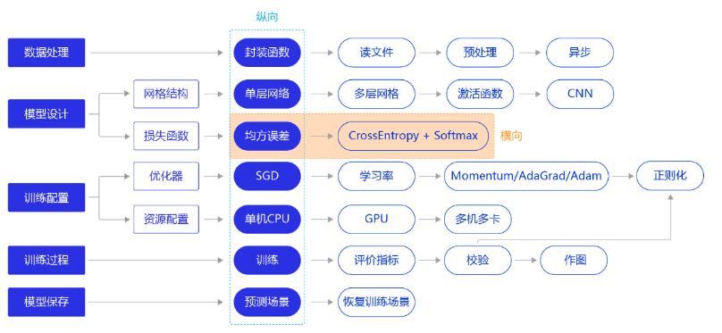
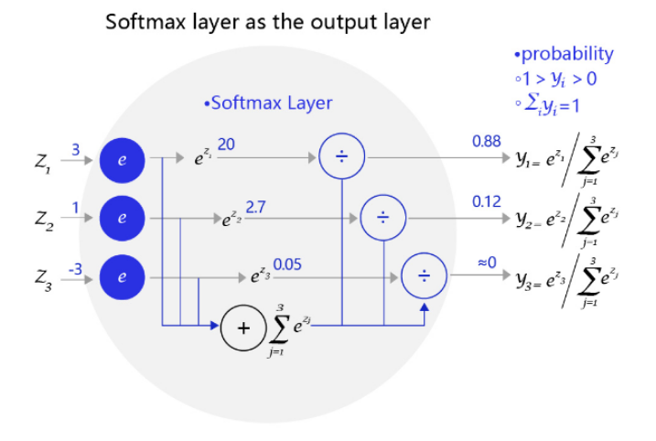
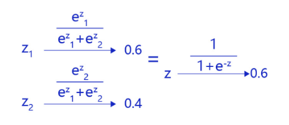

# 损失函数

[toc]



损失函数是模型优化的目标，用于在众多的参数取值中，识别最理想的取值。损失函数的计算在训练过程的代码中，每一轮模型训练的过程都相同，分如下三步：

1. 先根据输入数据正向计算预测输出。
2. 再根据预测值和真实值计算损失。
3. 最后根据损失反向传播梯度并更新参数。

## 分类任务的损失函数

1. 房价预测是回归任务，而手写数字识别是分类任务，使用均方误差作为分类任务的损失函数存在逻辑和效果上的缺欠。
2. 房价可以是大于0的任何浮点数，而手写数字识别的输出只可能是0-9之间的10个整数，相当于一种标签。
3. 在房价预测的案例中，由于房价本身是一个连续的实数值，因此以模型输出的数值和真实房价差距作为损失函数（loss）是符合道理的。但对于分类问题，真实结果是分类标签，而模型输出是实数值，导致以两者相减作为损失不具备物理含义。

分类任务本质上是“某种特征组合下的分类概率”：


在本案例中，医生根据肿瘤大小*x*作为肿瘤性质*y*的参考判断（判断的因素有很多，肿瘤大小只是其中之一），那么我们观测到该模型判断的结果是*x*和*y*的标签（1为恶性，0为良性）。而这个数据背后的规律是不同大小的肿瘤，属于恶性肿瘤的概率。观测数据是真实规律抽样下的结果，分类模型应该拟合这个真实规律，输出属于该分类标签的概率。

### Softmax函数

$softmax(xi)=  \frac{e^{x_{i}}}{\sum_{j=0}^{N} e^{x}_{j}},i=0,...,C−1$，

*C*为标签类别个数

如果模型能输出10个标签的概率，对应真实标签的概率输出尽可能接近100%，而其他标签的概率输出尽可能接近0%，且所有输出概率之和为1。这是一种更合理的假设！与此对应，真实的标签值可以转变成一个10维度的one-hot向量，在对应数字的位置上为1，其余位置为0，比如标签“6”可以转变成[0,0,0,0,0,0,1,0,0,0]。

对应到代码上，需要再网络定义部分修改输出层：

```python
self.fc = Linear(input_dim=10, output_dim=1, act='softmax')
```

即是对全连接层的输出加一个softmax运算



**以二分类为例探讨使用softmax的原因：**

对于二分类问题，使用两个输出接入softmax作为输出层，等价于使用单一输入接入sigmod函数



利用两个标签的输出概率之和为1的条件，softmax输出0.6和0.4两个标签概率，从数学上等价于输出一个标签的概率为0.6，在这种情况下，只有一层的模型为$S(w^{T}x_{i})$ , *S*为Sigmoid函数。模型预测为1的概率为$S(w^{T}x_{i})$ ，模型预测为0的概率为1$-S(w^{T}x_{i})$ 


## 交叉熵

在模型输出为分类标签的概率时，使用交叉熵误差代替直接以标签和概率作为分类问题的损失衡量更加合理。

交叉熵损失函数的设计是基于最大似然思想：最大概率得到观察结果的假设是真的。

**贝叶斯公式：**

​														$P(A\bigcap B)=P(A)*P(B|A)=P(B)*P(B|A)$

经过公式推导，使得上述概率最大等价于最小化交叉熵，得到交叉熵的损失函数。交叉熵的公式如下：

​                 			        					$L=-[\sum_{k=1}^{n}t_{k}\log yk+(1-t_{k})\log(1-y_{k})]$

其中，$y_{k}$表示模型输出就，$t_{k}$代表各个标签，$t_{k}$中只有正确解的标签为1，其余均为0(one-hot表示).

交叉熵只计算对应着“正确解”标签的输出的自然对数。假设正确标签的索引是“2”，对应的神经网络输出是0.6，则交叉熵误差是$-log 0.6=0.51$ 

### 代码实现：

*以手写数字识别为例*

* 读取数据部分，将标签的类型设置为`int`, 体现它是一个标签而不是实数值（飞桨默认将标签处理成"int64"
* 在网络定义部分，将输出层改成“输出十个标签的概率”的模式
* 在训练过程部分，将损失函数从均方误差换成交叉熵

在数据处理部分，需要修改标签变量Label的格式，代码如下：

* 从：`label = np.reshape(labels[i], [1]).astype('float32')`
* 到：`label = np.reshape(labels[i], [1]).astype('int64')`

**修改标签数据的格式：**

```python
import os
import random
import paddle
import paddle.fluid as fluid
from paddle.fluid.dygraph.nn import Conv2D, Pool2D, Linear
import numpy as np
from PIL import Image

import gzip
import json

# 定义数据集读取器
def load_data(mode='train'):

    # 数据文件
    datafile = './work/mnist.json.gz'
    print('loading mnist dataset from {} ......'.format(datafile))
    data = json.load(gzip.open(datafile))
    train_set, val_set, eval_set = data

    # 数据集相关参数，图片高度IMG_ROWS, 图片宽度IMG_COLS
    IMG_ROWS = 28
    IMG_COLS = 28

    if mode == 'train':
        imgs = train_set[0]
        labels = train_set[1]
    elif mode == 'valid':
        imgs = val_set[0]
        labels = val_set[1]
    elif mode == 'eval':
        imgs = eval_set[0]
        labels = eval_set[1]

    imgs_length = len(imgs)

    assert len(imgs) == len(labels), \
          "length of train_imgs({}) should be the same as train_labels({})".format(
                  len(imgs), len(labels))

    index_list = list(range(imgs_length))

    # 读入数据时用到的batchsize
    BATCHSIZE = 100

    # 定义数据生成器
    def data_generator():
        if mode == 'train':
            random.shuffle(index_list)
        imgs_list = []
        labels_list = []
        for i in index_list:
            img = np.reshape(imgs[i], [1, IMG_ROWS, IMG_COLS]).astype('float32')
            label = np.reshape(labels[i], [1]).astype('int64')
            imgs_list.append(img) 
            labels_list.append(label)
            if len(imgs_list) == BATCHSIZE:
                yield np.array(imgs_list), np.array(labels_list)
                imgs_list = []
                labels_list = []

        # 如果剩余数据的数目小于BATCHSIZE，
        # 则剩余数据一起构成一个大小为len(imgs_list)的mini-batch
        if len(imgs_list) > 0:
            yield np.array(imgs_list), np.array(labels_list)

    return data_generator
```

**在网络定义部分，需要修改输出层结构，代码如下所示：**

* 从：`self.fc = Linear(input_dim = 980, output_dim = 1, act = None)`
* 到：`self.fc = Linear(input_dim = 980, output_dim = 10, act = 'softmax')`

定义模型结构：

```python
class MNIST(fluid.dygraph.Layer):
     def __init__(self):
         super(MNIST, self).__init__()
         
         # 定义一个卷积层，使用relu激活函数
         self.conv1 = Conv2D(num_channels=1, num_filters=20, filter_size=5, stride=1, padding=2, act='relu')
         # 定义一个池化层，池化核为2，步长为2，使用最大池化方式
         self.pool1 = Pool2D(pool_size=2, pool_stride=2, pool_type='max')
         # 定义一个卷积层，使用relu激活函数
         self.conv2 = Conv2D(num_channels=20, num_filters=20, filter_size=5, stride=1, padding=2, act='relu')
         # 定义一个池化层，池化核为2，步长为2，使用最大池化方式
         self.pool2 = Pool2D(pool_size=2, pool_stride=2, pool_type='max')
         # 定义一个全连接层，输出节点数为10 
         self.fc = Linear(input_dim=980, output_dim=10, act='softmax')
    # 定义网络的前向计算过程
     def forward(self, inputs):
         x = self.conv1(inputs)
         x = self.pool1(x)
         x = self.conv2(x)
         x = self.pool2(x)
         x = fluid.layers.reshape(x, [x.shape[0], 980])
         x = self.fc(x)
         return x
```

**修改计算损失的函数，从均方误差到交叉熵误差**

* 从：`fluid.layers.square_error_cost(predict, label)`
* 到：`fluid.layers.cross_entropy(predict, label)`


***仅修改计算损失的函数，从均方误差（常用于回归问题）到交叉熵误差（常用于分类问题）***

```python
with fluid.dygraph.guard():
    model = MNIST()
    model.train()
    #调用加载数据的函数
    train_loader = load_data('train')
    optimizer = fluid.optimizer.SGDOptimizer(learning_rate=0.01, parameter_list=model.parameters())
    EPOCH_NUM = 5
    for epoch_id in range(EPOCH_NUM):
        for batch_id, data in enumerate(train_loader()):
            #准备数据，变得更加简洁
            image_data, label_data = data
            image = fluid.dygraph.to_variable(image_data)
            label = fluid.dygraph.to_variable(label_data)
            
            #前向计算的过程
            predict = model(image)
            
            #计算损失，使用交叉熵损失函数，取一个批次样本损失的平均值
            loss = fluid.layers.cross_entropy(predict, label)
            avg_loss = fluid.layers.mean(loss)
            
            #每训练了200批次的数据，打印下当前Loss的情况
            if batch_id % 200 == 0:
                print("epoch: {}, batch: {}, loss is: {}".format(epoch_id, batch_id, avg_loss.numpy()))
            
            #后向传播，更新参数的过程
            avg_loss.backward()
            optimizer.minimize(avg_loss)
            model.clear_gradients()

    #保存模型参数
    fluid.save_dygraph(model.state_dict(), 'mnist')
```

**注：**

虽然上述训练过程的损失明显比均方误差算法要小，但因为损失函数量纲的变化，我们无法从比较两个不同的Loss得出谁更加优秀，但是可以通过分类准确率高低来进行判断。

由于修改了模型的输出格式，因此使用模型做预测时的代码也需要做相应的调整。从模型输出10个标签的概率中选择最大的，将其标签编号输出

```python
# 读取一张本地的样例图片，转变成模型输入的格式
def load_image(img_path):
    # 从img_path中读取图像，并转为灰度图
    im = Image.open(img_path).convert('L')
    im.show()
    im = im.resize((28, 28), Image.ANTIALIAS)
    im = np.array(im).reshape(1, 1, 28, 28).astype(np.float32)
    # 图像归一化
    im = 1.0 - im / 255.
    return im

# 定义预测过程
with fluid.dygraph.guard():
    model = MNIST()
    params_file_path = 'mnist'
    img_path = './work/example_0.jpg'
    # 加载模型参数
    model_dict, _ = fluid.load_dygraph("mnist")
    model.load_dict(model_dict)
    
    model.eval()
    tensor_img = load_image(img_path)
    #模型反馈10个分类标签的对应概率
    results = model(fluid.dygraph.to_variable(tensor_img))
    #取概率最大的标签作为预测输出
    lab = np.argsort(results.numpy())
    print("本次预测的数字是: ", lab[0][-1])
```

